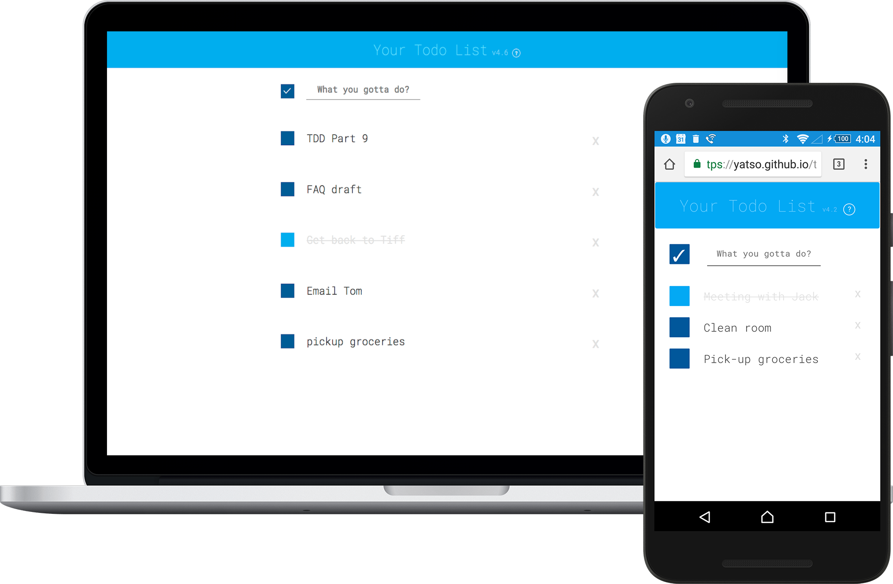
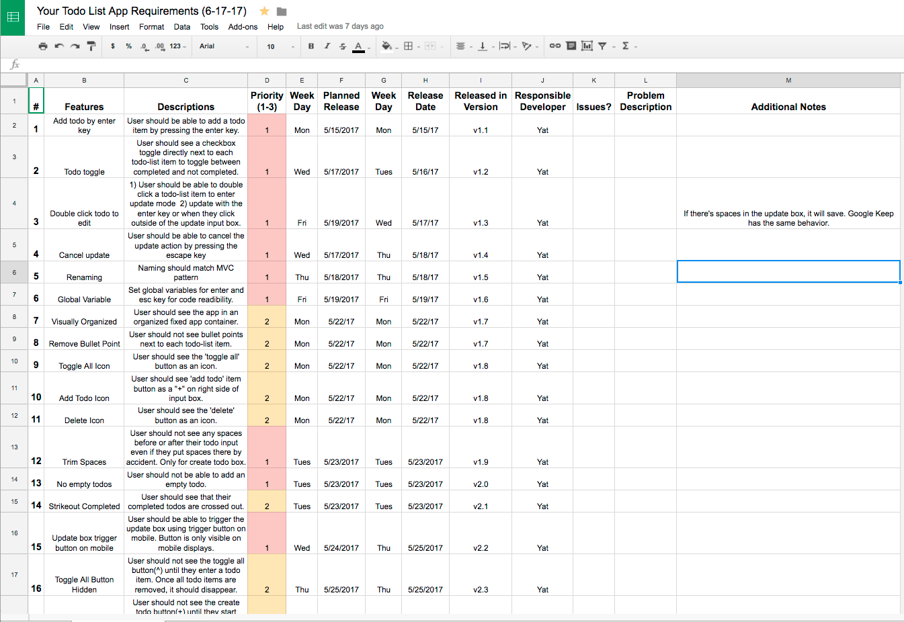

## Live Demo: https://yatso.github.io/todo-list-vanillajs/

# Your Todo List

A fully-functional, mobile-first responsive CRUD (Create/Read/Update/Delete) App. Built from scratch w/vanilla HTML, CSS, JavaScript without the help of any libraries or frameworks. No bootstrap, no jQuery, no Angular, just plain old JavaScript. It's lightweight, fast, & beautiful under the hood. Try it out!

## Product Requrements Spreadsheet

Live spreadsheet of where I keep track of features/bug fixes for this project
https://docs.google.com/spreadsheets/d/1FBzzkegbim7s9JL9w2T45eQT4UU22N3eE4hX197ILSg/edit?usp=sharing

## Authors

* **Yat So**  - [yatso](https://github.com/yatso)

See also the list of [contributors](https://github.com/yatso/todo-list-vanillajs/contributors) who participated in this project.

## License

This project is licensed under the MIT License - see the [LICENSE](LICENSE) file for details

## Acknowledgments

* This project was inspired by Practical Javascript, WatchAndCode.com 

